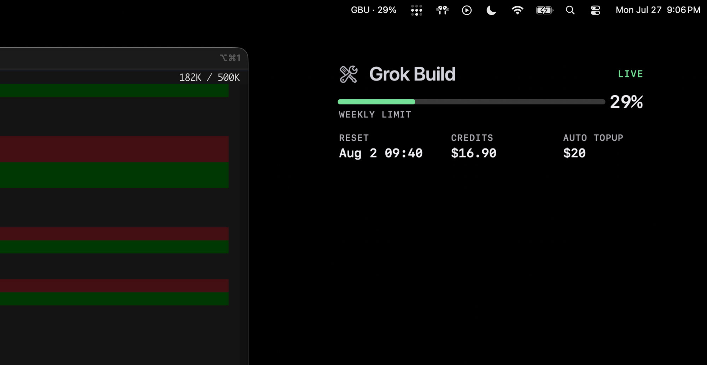

# Grok Build Usage

**Always-on macOS menu bar + floating HUD for [Grok Build](https://grok.com) credit usage.**

A small glanceable gauge for your **account** weekly/monthly limit, prepaid credits, and reset time — the same kind of numbers you see under Grok.com Settings → Usage or Build’s `/usage`, without keeping a browser tab open.

Works with **your** Grok login: it reuses the session Grok Build already stores on disk. No separate API key setup for the pool gauge.

> Unofficial community tool. Not affiliated with xAI. Billing endpoints can change; if they do, open an issue.

## Screenshot

Floating chrome-free overlay on the desktop, with the menu bar title (`GBU · 29%`) and live account pool:



Toggle the overlay from the menu bar anytime (**Hide / Show Overlay**).

## Requirements

| Need | Notes |
|------|--------|
| **macOS** | Menu bar + AppKit HUD |
| **Python 3.10+** | 3.11/3.12 recommended |
| **Grok Build logged in** | Run `grok login` (or `/login` in the TUI) once so `~/.grok/auth.json` exists |

## Install (anyone)

```bash
git clone https://github.com/vbusnita/grok-build-usage.git
cd grok-build-usage
./scripts/install-app.sh --login --open
```

That will:

1. Create a local `.venv` and install this package  
2. Build **`~/Applications/Grok Build Usage.app`** (menu-bar agent — **no Dock icon**)  
3. Register a **LaunchAgent** so it starts at login (`--login`)  
4. Launch it (`--open`)

Then look for **`GBU · …%`** in the menu bar. Use **Hide / Show Overlay**, **Refresh Now**, **Open Grok Usage…**, or **Quit**.

### Without login-at-start

```bash
./scripts/install-app.sh --open
```

### Uninstall

```bash
./scripts/uninstall-app.sh
```

(Only removes the `.app` + LaunchAgent. Your clone and Grok login stay.)

### Logs

`~/Library/Logs/grok-build-usage.log`

## CLI (optional)

```bash
source .venv/bin/activate
gbu              # menu bar + overlay
gbu --hidden     # menu bar only
gbu --once       # print one snapshot, no UI
gbu --poll 20    # refresh every 20s
```

## How it works (for your account)

1. **Auth** — reads the OIDC session from `~/.grok/auth.json` written by Grok Build.  
2. **Billing** — `GET https://cli-chat-proxy.grok.com/v1/billing?format=credits` (same family of calls Build uses for `/usage`).  
3. **Auto top-up** — optional `…/auto-topup-rule`.  
4. **UI** — menu bar + floating always-on-top HUD; polls about every 45s.

No credentials are sent anywhere except xAI. This app does not store your password.

If auth expires, the HUD says so — open Grok Build and `/login` again.

## Privacy & security

See [SECURITY.md](SECURITY.md). Short version: local session reuse, local logs, xAI-only network.

## Development

```bash
git clone https://github.com/vbusnita/grok-build-usage.git
cd grok-build-usage
python3.11 -m venv .venv && source .venv/bin/activate
pip install -e .
pip install pytest
pytest -q
```

See [CONTRIBUTING.md](CONTRIBUTING.md).

## Project layout

```
src/gbu/
  auth.py       # ~/.grok/auth.json
  billing.py    # CLI proxy billing fetch
  models.py     # UsageSnapshot
  hud.py        # floating chrome-free HUD
  app.py        # rumps menu bar
  __main__.py   # CLI
scripts/
  install-app.sh
  uninstall-app.sh
```

## Roadmap

- [x] Menu bar app + LaunchAgent install script  
- [ ] Signed / notarized `.app` release (no local clone required)  
- [ ] Token refresh without reopening Grok Build  
- [ ] Optional per-session token burn next to the account pool  
- [ ] Homebrew formula / cask  

## Disclaimer

This project is **not** an official xAI product. It depends on Grok Build’s local auth file and billing HTTP shapes that may change without notice. Use at your own risk.

## License

[MIT](LICENSE) © Victor Busnita
